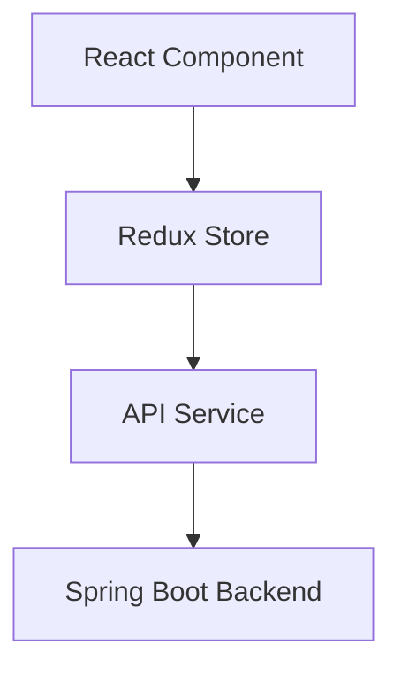

# Contributing to the Full Stack Engineering Guide

Thank you for your interest in contributing to this project! This guide is a community-driven resource, and we welcome contributions from engineers of all experience levels.

## How to Contribute

### 1. Types of Contributions

We welcome the following types of contributions:

- **Bug Fixes**: Typos, broken links, incorrect code examples
- **New Content**: Additional patterns, best practices, code examples
- **Improvements**: Better explanations, updated examples, enhanced diagrams
- **Translations**: Help translate content to other languages
- **Documentation**: Improve existing documentation structure

### 2. Getting Started

#### Fork and Clone
```bash
# Fork the repository on GitHub
git clone https://github.com/YOUR_USERNAME/guide.git
cd guide

# Add upstream remote
git remote add upstream https://github.com/ORIGINAL_OWNER/guide.git
```

#### Create a Branch
```bash
git checkout -b feature/your-feature-name
# or
git checkout -b fix/your-fix-name
```

### 3. Making Changes

#### Documentation Standards

**File Naming:**
- Use lowercase with hyphens (kebab-case): `my-new-feature.md`
- Place in the appropriate topic directory (e.g., `docs/java/`, `docs/react/`, `docs/architecture/`)
- Update the relevant `index.md` file if one exists for the topic

**Markdown Formatting:**
```markdown
# Main Title (H1) - Only one per document

## Major Section (H2)

### Subsection (H3)

**Bold for emphasis**
*Italic for terms*
`code for inline code`

```java
// Code blocks with language specified
public class Example {
    // ...
}
```

> Blockquotes for important notes

- Bullet points
  - Nested points
1. Numbered lists
2. When order matters
```

**Code Examples:**
- Always specify language for syntax highlighting
- Include comments explaining complex logic
- Provide complete, runnable examples when possible
- Show both good ✅ and bad ❌ practices

```java
// ✅ Good: Use dependency injection
@Service
public class UserService {
    private final UserRepository userRepository;

    public UserService(UserRepository userRepository) {
        this.userRepository = userRepository;
    }
}

// ❌ Bad: Field injection
@Service
public class UserService {
    @Autowired
    private UserRepository userRepository;
}
```

**Links:**
- Use relative links for internal documentation
- Use absolute URLs for external resources
- Check all links work before submitting

```markdown
[Internal Link](../path/to/file.md)
[External Link](https://example.com)
```

#### Java Code Standards

- Use Java 17 or 21 features
- Follow Spring Boot best practices
- Include proper exception handling
- Add JavaDoc for public methods
- Use records for DTOs (Java 14+)

#### React Code Standards

- Use functional components with hooks
- TypeScript for type safety
- Follow React best practices
- Include prop types or TypeScript interfaces
- Add comments for complex logic

### 4. Testing Your Changes

Before submitting:

**Check Markdown:**
```bash
# Install markdown linter (optional)
npm install -g markdownlint-cli

# Check your files
markdownlint **/*.md
```

**Verify Links:**
```bash
# Install link checker (optional)
npm install -g markdown-link-check

# Check links
markdown-link-check docs/**/*.md
```

**Preview Locally:**
- Use a Markdown previewer (VS Code, GitHub Desktop)
- Ensure code blocks render correctly
- Check images display properly

### 5. Commit Guidelines

**Commit Message Format:**
```
<type>(<scope>): <subject>

<body>

<footer>
```

**Types:**
- `feat`: New feature or content
- `fix`: Bug fix or correction
- `docs`: Documentation improvements
- `style`: Formatting changes
- `refactor`: Restructuring content
- `test`: Adding tests or examples
- `chore`: Maintenance tasks

**Examples:**
```bash
git commit -m "feat(java): add caching patterns with Caffeine"
git commit -m "fix(react): correct useState example in hooks section"
git commit -m "docs(architecture): improve microservices diagram"
```

### 6. Submitting a Pull Request

#### Before Submitting

- [ ] Read through your changes
- [ ] Check for typos and grammar
- [ ] Verify all code examples work
- [ ] Test all links
- [ ] Update table of contents if needed
- [ ] Follow the style guide

#### Pull Request Process

1. **Update Your Branch:**
```bash
git fetch upstream
git rebase upstream/main
```

2. **Push to Your Fork:**
```bash
git push origin feature/your-feature-name
```

3. **Create Pull Request:**
- Go to GitHub and create a new Pull Request
- Use a clear, descriptive title
- Fill out the PR template
- Link any related issues

**PR Title Examples:**
```
Add WebSocket integration patterns for Spring Boot
Fix typos in React hooks documentation
Update architecture diagrams with C4 model
```

**PR Description Template:**
```markdown
## Description
Brief description of changes

## Type of Change
- [ ] Bug fix
- [ ] New feature/content
- [ ] Documentation improvement
- [ ] Code example update

## Changes Made
- Change 1
- Change 2

## Checklist
- [ ] Code examples tested
- [ ] Links verified
- [ ] Documentation updated
- [ ] Followed style guide

## Screenshots (if applicable)
```

### 7. Code Review Process

- Maintainers will review your PR
- Address feedback promptly
- Make requested changes in new commits
- Once approved, maintainers will merge

**Responding to Feedback:**
```bash
# Make changes based on feedback
git add .
git commit -m "Address review feedback: update examples"
git push origin feature/your-feature-name
```

## Content Guidelines

### Writing Style

- **Clear and Concise**: Get to the point quickly
- **Practical**: Include real-world examples
- **Accurate**: Verify information before contributing
- **Consistent**: Match existing documentation style
- **Accessible**: Write for engineers with varying experience levels

### Code Quality

**Java Examples:**
```java
// Include package and imports
package com.example.demo;

import org.springframework.stereotype.Service;

/**
 * Service for managing user operations.
 *
 * @author Your Name
 */
@Service
public class UserService {
    // Well-documented, complete examples
}
```

**React Examples:**
```typescript
// Include imports
import React, { useState, useEffect } from 'react';

/**
 * UserList component displays a list of users.
 */
export const UserList: React.FC<Props> = ({ limit }) => {
    // Type-safe, modern React patterns
};
```

### Diagrams and Visuals

- Use Mermaid for diagrams when possible
- Keep diagrams simple and clear
- Include ASCII art for simple flows
- Add alt text for images

**Mermaid Example:**
```markdown

```

## Community Standards

### Code of Conduct

- Be respectful and inclusive
- Welcome newcomers
- Provide constructive feedback
- Focus on the content, not the person
- Help others learn and grow

### Communication

- Use GitHub Issues for bug reports
- Use GitHub Discussions for questions
- Tag maintainers when needed (@username)
- Be patient - maintainers are volunteers

## Recognition

Contributors will be recognized in:
- GitHub contributors page
- Special mentions for significant contributions
- Community highlights

## Questions?

- **Documentation Issues**: Open a GitHub Issue
- **General Questions**: Use GitHub Discussions
- **Security Issues**: Email security@example.com (if applicable)

## License

By contributing, you agree that your contributions will be licensed under the same license as the project (MIT License).

---

Thank you for contributing to the Full Stack Engineering Guide! Your contributions help engineers worldwide learn and grow.

**Happy Contributing!** 🚀
