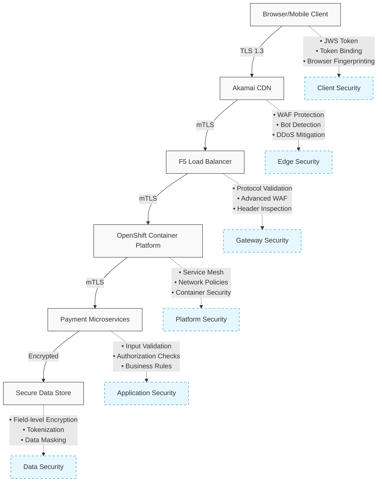

# Payment System Security Architecture

This document outlines the multi-layered approach to securing payment data across our infrastructure, from user browser to backend microservices.

## Security Architecture Overview

## Layer-by-Layer Security Controls

### 1. Browser/Client Layer

| Security Mechanism | Description | Protection Provided |
|-------------------|-------------|---------------------|
| TLS 1.3 | Latest Transport Layer Security with PFS ciphers | Protects data in transit from eavesdropping |
| HttpOnly Cookies | Prevents JavaScript access to authentication cookies | Mitigates XSS token theft |
| SameSite Cookies | Restricts cookie transmission to same-site requests | Prevents CSRF attacks |
| Certificate Pinning | Validates server certificates against known good values | Prevents MITM with fake certificates |
| Browser Fingerprinting | Binds session to device characteristics | Detects session hijacking attempts |
| Client-side Input Validation | Validates data before submission | First line of defense against injection |

### 2. Akamai CDN Layer

| Security Mechanism | Description | Protection Provided |
|-------------------|-------------|---------------------|
| Edge WAF | Web Application Firewall at network edge | Blocks OWASP Top 10 attacks |
| Bot Manager | ML-based bot detection and mitigation | Prevents automated attacks |
| DDoS Protection | Absorbs and filters attack traffic | Maintains availability during attacks |
| Client Reputation | IP-based reputation scoring | Blocks known malicious sources |
| Request Rate Limiting | Throttles excessive requests | Prevents brute force and enumeration |
| TLS Termination | Initial secure connection handling | Ensures proper encryption |
| Request Signing | Adds Akamai-specific signature headers | Verifies traffic passed through Akamai |

### 3. F5 Load Balancer Layer

| Security Mechanism | Description | Protection Provided |
|-------------------|-------------|---------------------|
| Advanced WAF | ModSecurity with OWASP CRS and custom rules | Deep request inspection and filtering |
| Protocol Validation | Strict HTTP protocol compliance | Prevents protocol-based attacks |
| TLS Re-encryption | Re-encrypts traffic to backend | Maintains encryption throughout the path |
| iRules/iControl | Custom traffic inspection logic | Implements business-specific security rules |
| Header Sanitization | Normalizes and validates HTTP headers | Prevents header injection attacks |
| JSON/XML Inspection | Deep content validation | Blocks malformed data structures |
| Request Transformation | Modifies requests for security | Removes potentially dangerous elements |

### 4. OpenShift Container Platform Layer

| Security Mechanism | Description | Protection Provided |
|-------------------|-------------|---------------------|
| Service Mesh (Istio) | Service-to-service communication control | Provides mTLS between microservices |
| Network Policies | Kubernetes-native firewall rules | Isolates pods and namespaces |
| Container Security | Image scanning and runtime protection | Prevents vulnerable containers |
| Pod Security Contexts | Restricts container privileges | Limits potential exploit impact |
| Dynamic Admission Control | Validates resources at creation time | Enforces security policies |
| Role-Based Access Control | Fine-grained authorization | Controls administrative access |
| Secret Management | Secure storage for sensitive values | Protects credentials and keys |

### 5. Microservices Application Layer

| Security Mechanism | Description | Protection Provided |
|-------------------|-------------|---------------------|
| JWT Validation | Verifies token signatures and claims | Ensures proper authentication |
| Input Validation | Schema and business rule validation | Prevents injection and logic attacks |
| Authorization Checks | Fine-grained permission enforcement | Controls access to functions |
| API Rate Limiting | Per-endpoint request throttling | Prevents abuse of APIs |
| Transaction Signing | Cryptographic validation of operations | Ensures non-repudiation |
| Idempotency Keys | Unique operation identifiers | Prevents duplicate transactions |
| Request Tracing | Distributed request tracking | Enables security auditing |

### 6. Data Security Layer

| Security Mechanism | Description | Protection Provided |
|-------------------|-------------|---------------------|
| Field-level Encryption | Encrypts specific sensitive fields | Protects data even with DB access |
| Data Tokenization | Replaces sensitive data with tokens | Minimizes exposure of actual data |
| Data Masking | Hides portions of sensitive data | Limits exposure in logs and reports |
| Secure Key Management | HSM-based encryption key handling | Protects cryptographic material |
| Data Classification | Identifies and handles data by sensitivity | Applies appropriate controls |
| Audit Logging | Records all data access and changes | Enables forensic investigation |
| Retention Policies | Manages data lifecycle | Limits unnecessary data storage |

## Preventing Man-in-the-Middle Attacks

Our architecture specifically addresses MITM attacks through:

1. **End-to-end Message Integrity**
   - JWS (JSON Web Signatures) for payment payloads
   - Digital signatures using asymmetric cryptography (RSA/ECDSA)
   - Request signing at application level, independent of TLS

2. **Multi-layered Encryption**
   - TLS 1.3 with PFS at all network boundaries
   - Field-level encryption for sensitive values
   - Mutual TLS between internal services

3. **Certificate Security**
   - Certificate pinning in client applications
   - Certificate Transparency monitoring
   - Short-lived certificates with automated rotation

## Preventing Replay Attacks

Our architecture prevents replay attacks through:

1. **Request-specific Values**
   - One-time nonces included in each request
   - Cryptographic timestamps with limited validity windows
   - Idempotency keys for payment operations

2. **Token Controls**
   - Short-lived access tokens (typical TTL: 15 minutes)
   - Single-use authorization tokens for payments
   - Transaction-specific cryptographic signatures

## Transaction Security Example

For a typical payment flow, security is enforced as follows:

1. **Authentication**
   - User authenticates with primary credentials + 2FA
   - Limited-scope session token issued (JWT in HttpOnly cookie)
   - Token contains minimal information with short expiration

2. **Payment Initiation**
   - User enters payment details
   - Client requests transaction-specific token
   - System issues one-time use token with transaction parameters
   - JWS signature applied to transaction details

3. **Payment Authorization**
   - Out-of-band challenge sent to verified device
   - User confirms transaction details on separate channel
   - Both main session token and one-time authorization required
   - Multiple security layers must be satisfied simultaneously

## Implementation Guidelines

When implementing new payment features:

1. **Defense in Depth**
   - Never rely on a single security control
   - Assume each layer could be compromised
   - Implement controls at each architectural level

2. **Principle of Least Privilege**
   - Grant minimal necessary access
   - Time-bound authorizations
   - Context-specific permissions

3. **Secure Defaults**
   - All channels encrypted by default
   - Authentication required by default
   - Explicit opt-in for sensitive operations

## Security Testing Requirements

All payment system components must undergo:

1. Regular penetration testing
2. Threat modeling during design
3. Static and dynamic application security testing
4. Regular security control validation

---

**Note**: This document should be treated as sensitive information and shared only with authorized personnel.